# Módulo facturación

## Instalación del  modulo de facturación  

Desplegamos el menu de aplicaciones y hacemos clic en **Aplicaciones.**
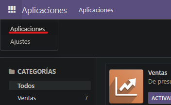  
Y activamos el modulo de **facturación.**  
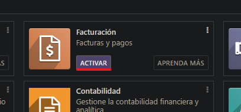  

## Configuración del modulo de facturación  

En el modulo de facturación seguire los pasos para rellenar con la información de mi empresa.  
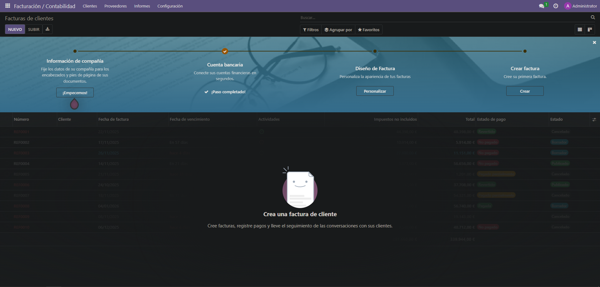  
De esta forma rellenare los datos de una empresa ficticia.  
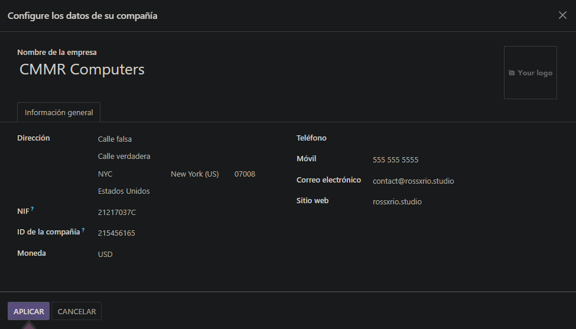  
Además añadire un codigo QR para las facturas.  

## Gestion de usuarios  

Para crear un nuevo usuario entraremos en la pantalla de ajustes.  
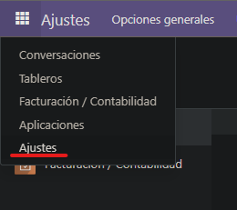  
Haremos clic a gestionar usuarios  
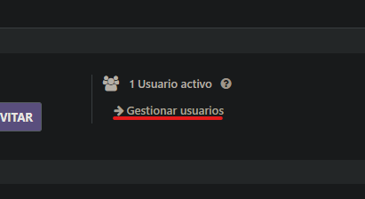  
Y clic en nuevo para empezar a crear el nuevo usuario  
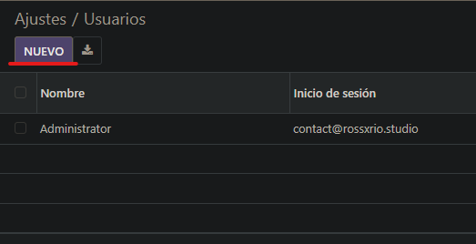  
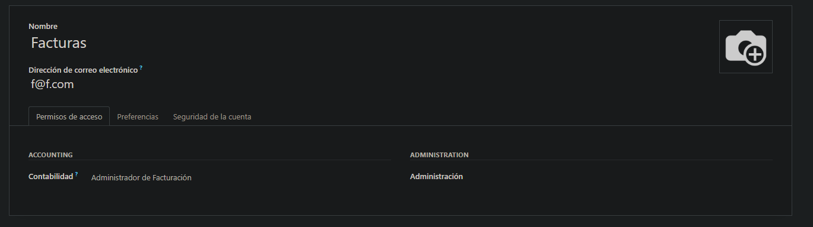  
Ahora clic en nuevo  
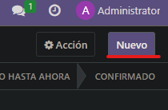  

## Personalización de la factura  

Ahora cambiare el diseño de la factura  
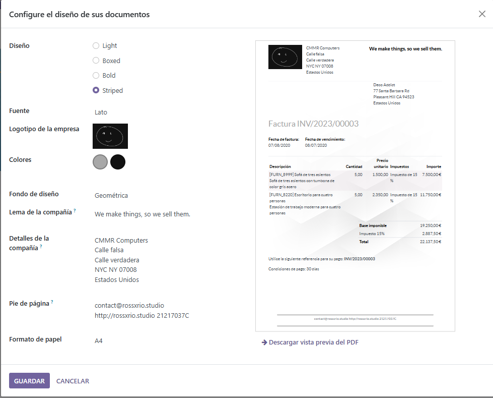  

## Clientes y creación de facturas

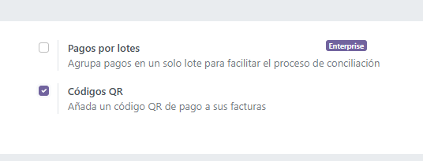  
Ahora importare los usuarios del fichero ```clients.csv```  
Desplegaré el menu de **clientes** y hare clic en **clientes**.  
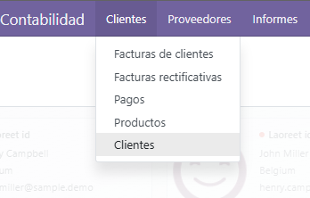  
Luego colocaré el mouse sobre **favoritos** y clicare en **importar registros.**  
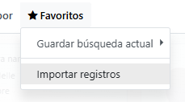  
En esta pantalla hare clic en **subir archivo**  
  
Luego enlazaré los campos de **odoo** con los del fichero **clientes.csv**  
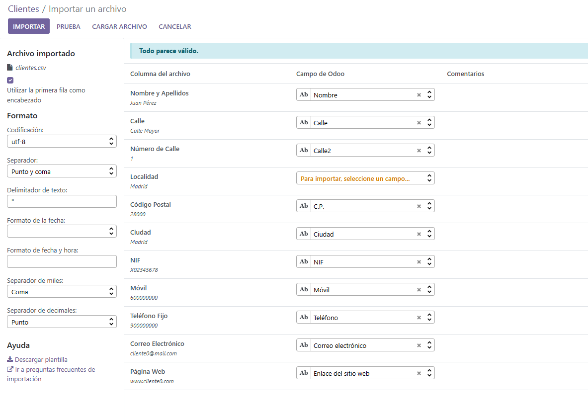  
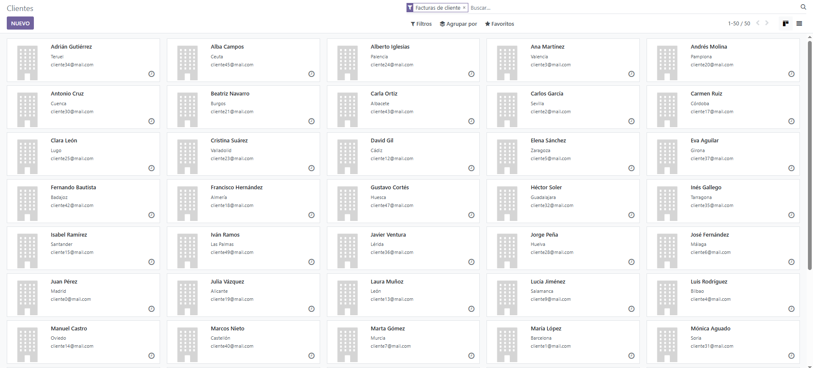  
Para este paso es importante decir que estoy operando con el usuario el usuario **facturas** creado previamente.  
Esta es la factura que cree con un producto inventado  
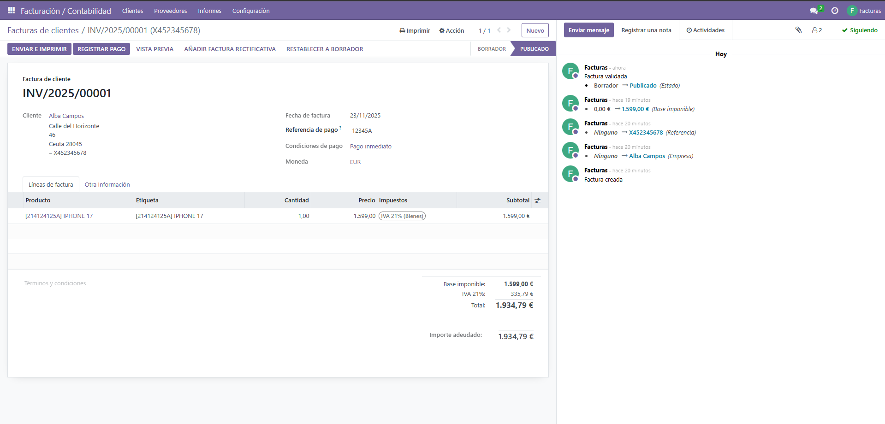
[PDF Factura](INV_2025_00001.pdf)

[<- BACK](../index.md)
