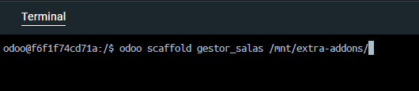
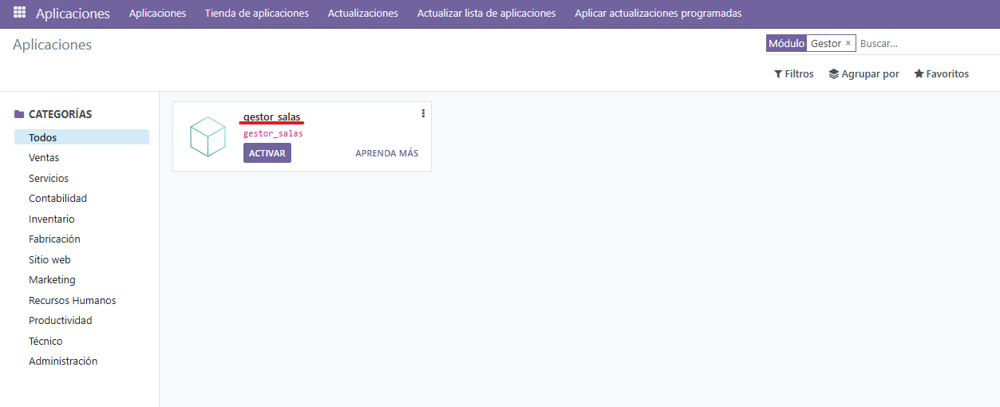
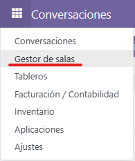
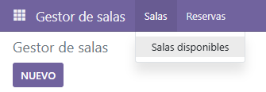
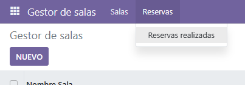

# PR0501: Creación de un módulo básico

## Creación del modulo

Para crear un modulo de odoo usaremos el comando

```bash
odoo scaffold nombre_modulo ruta/del/modulo
```

  

Este comando nos dara una plantilla sobre la que partir.  
Primero deberemos 'descomentar' el codigo generado en los archivos:

``` bash
C:.
└───gestor_salas
    ├───controllers
    │       controllers.py
    │           
    ├───demo
    │       demo.xml
    │       
    ├───models
    │       models.py
    │       
    ├───views
    │       templates.xml
    │       views.xml
```

Ahora tendremos que hacer las modificaciones respectivas a nuestro modulo.

```py
models.py
from odoo import models, fields, api


class gestor_salas(models.Model):
    _name = 'gestor_salas.gestor_salas'
    _description = 'gestor_salas.gestor_salas'

    nombre_sala = fields.Char()
    capacidad = fields.Integer()
    fecha_reserva = fields.Date()
    reservada = fields.Boolean()
    comentarios = fields.Char()
```

```xml
views.xml
<odoo>
    <data>
        <!-- explicit list view definition -->
        <record model="ir.ui.view" id="gestor_salas.list">
            <field name="name">gestor_salas list</field>
            <field name="model">gestor_salas.gestor_salas</field>
            <field name="arch" type="xml">
                <tree>
                    <field name="nombre_sala"/>
                    <field name="capacidad"/>
                    <field name="fecha_reserva"/>
                    <field name="reservada"/>
                    <field name="comentarios"/>
                </tree>
            </field>
        </record>

        <!-- actions opening views on models -->
        <record model="ir.actions.act_window" id="gestor_salas.action_window">
            <field name="name">Gestor de salas</field>
            <field name="res_model">gestor_salas.gestor_salas</field>
            <field name="view_mode">tree,form</field>
        </record>

        <!-- server action to the one above -->
        <record model="ir.actions.server" id="gestor_salas.action_server">
            <field name="name">Gestor de salas</field>
            <field name="model_id" ref="model_gestor_salas_gestor_salas"/>
            <field name="state">code</field>
            <field name="code">
                action = {
                "type": "ir.actions.act_window",
                "view_mode": "tree,form",
                "res_model": model._name,
                }
            </field>
        </record>

        <!-- Top menu item -->
        <menuitem name="Gestor de salas" id="gestor_salas.menu_root"/>
        <!-- menu categories -->
        <menuitem name="Salas" id="gestor_salas.menu_1" parent="gestor_salas.menu_root"/>
        <menuitem name="Reservas" id="gestor_salas.menu_2" parent="gestor_salas.menu_root"/>
        <!-- actions -->
        <menuitem name="Salas disponibles" id="gestor_salas.menu_1_list" parent="gestor_salas.menu_1"
                  action="gestor_salas.action_window"/>
        <menuitem name="Reservas realizadas" id="gestor_salas" parent="gestor_salas.menu_2"/>
    </data>
</odoo>
```

En el archivo ```__manifest__.py``` nos aseguraremos de que la linea ```'security/ir.model.access.csv',``` este descomentada.

## Visualización del modulo en Odoo

Ahora arrancaremos el servidor e instalaremos el modulo creado.  
Nos aseguraremos del que el modo desarollador este activado  
  

Iremos al baúl de aplicaciones y buscaremos el modulo creado.  
  

Clicaremos en activar y haremos clic en el menu de aplicaciones. Aquí veremos el menu de nivel 1 defindo en el archivo ```views.xml``` del modulo  


Dentro del modulo, tenemos definidos 2 menús de nivel que a su vez estos, tienen 1 menu del nivel tres cada uno.  
  


[<- BACK](../index.md)
