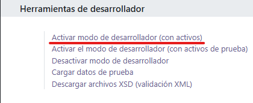
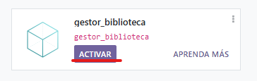
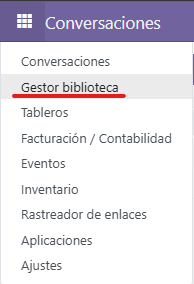
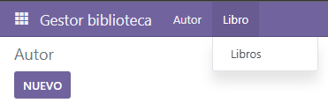

# PR0502: Módulo con dos modelos

## Creación de los dos modelos

Para la creación de los dos modelos he decidido crear los modelos ```autor``` y ```libro``` en el mismo archivo ```models.py```

```py
models.py
class Autor(models.Model):
    _name = 'gestor_biblioteca.autor'
    _description = 'gestor_biblioteca.autor'

    nombre = fields.Char()
    fechaNacimiento = fields.Date()
    biografia = fields.Char()
    libros = fields.Char()

class Libro(models.Model):
    _name = 'gestor_biblioteca.libro'
    _description = 'gestor_biblioteca.libro'

    nombre = fields.Char()
    autor = fields.Date()
    fechaPublicacion = fields.Date()
    isbn = fields.Char()
    sinopsis = fields.Char()
```

## Creación de las vistas para los mdelos

He decidido tambien mantener ambas vistas en el mismo archivo ```views.xml```

```xml
<odoo>
    <data>
        <!-- explicit list view definition -->

        <record model="ir.ui.view" id="gestor_biblioteca.autor_list">
            <field name="name">Autor</field>
            <field name="model">gestor_biblioteca.autor</field>
            <field name="arch" type="xml">
                <tree>
                    <field name="nombre"/>
                    <field name="fechaNacimiento"/>
                    <field name="biografia"/>
                    <field name="libros"/>
                </tree>
            </field>
        </record>

        <record model="ir.ui.view" id="gestor_biblioteca.libro_list">
            <field name="name">Libro</field>
            <field name="model">gestor_biblioteca.libro</field>
            <field name="arch" type="xml">
                <tree>
                    <field name="nombre"/>
                    <field name="autor"/>
                    <field name="fechaPublicacion"/>
                    <field name="isbn"/>
                    <field name="sinopsis"/>
                </tree>
            </field>
        </record>

        <!-- actions opening views on models -->
        <record model="ir.actions.act_window" id="gestor_biblioteca.autor_window">
            <field name="name">Autor</field>
            <field name="res_model">gestor_biblioteca.autor</field>
            <field name="view_mode">tree,form</field>
        </record>

        <record model="ir.actions.act_window" id="gestor_biblioteca.libro_window">
            <field name="name">Libro</field>
            <field name="res_model">gestor_biblioteca.libro</field>
            <field name="view_mode">tree,form</field>
        </record>

        <!-- Top menu item -->
        <menuitem name="Gestor biblioteca" id="gestor_biblioteca.menu_root"/>
        <!-- menu categories -->
        <menuitem name="Autor" id="gestor_biblioteca.menu_1" parent="gestor_biblioteca.menu_root"/>
        <menuitem name="Libro" id="gestor_biblioteca.menu_2" parent="gestor_biblioteca.menu_root"/>
        <!-- menu actions -->
        <menuitem name="Autores" id="gestor_biblioteca.menu_1_list" parent="gestor_biblioteca.menu_1"
                  action="gestor_biblioteca.autor_window"/>

        <menuitem name="Libros" id="gestor_biblioteca.menu_2_list" parent="gestor_biblioteca.menu_2"
                  action="gestor_biblioteca.libro_window"/>
    </data>
</odoo>
```

## Acceso

Antes de instalar el modulo tendremos que escribir 2 lineas para cada uno de los modelos en archivo ```ir.model.access.csv```.

```csv
access_gestor_biblioteca_libro,gestor_biblioteca.libro,model_gestor_biblioteca_libro,base.group_user,1,1,1,1

access_gestor_biblioteca_autor,gestor_biblioteca.autor,model_gestor_biblioteca_autor,base.group_user,1,1,1,1

```

## Instalación del módulo en Odoo

Primero hay que asegurar que el modo desarollador este activado. Esto lo podemos comprobar el con simbolo de un escarabajo en la parte superior derecha.  
  
En caso de no estar presente, debera ser activado. **Ajustes -> Herramientas de desarollador** y clic en  **Activar modo desarollador (con activos)**.  
  

Con el modo de desarollo activado, iremos a el baúl de aplicaciones, buscaremos el nombre del modulo y haremos clic en activar.  
  

En el menú principal aparecera el menu de nivel 1.  
  

Y dentro de la pantalla del modulo apareceran los menús de nivel 2 y cada uno con su menú de nivel 3.
  
  

[<- BACK](../index.md)
